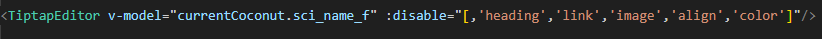
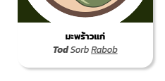

# อัพเดต 26 Sep.
### TO-DO

[สิ่งที่ต้องทำ](https://docs.google.com/spreadsheets/d/1NDhvBJG8o2P7wu1rH3hCp-lxJH54Xx8qc7zIhU5GLtk/edit?fbclid=IwY2xjawMEpXRleHRuA2FlbQIxMABicmlkETFrR05qd2ZpVjFvS1JDZlhvAR4jq867vR4WSRxRRc_JTi9aF1px4QyPiD9OHQQHxVuGbLEcnpR7GPCrvu0RQw_aem_OBtN9dfj11fhyJzG2bZGPA&gid=330990533#gid=330990533)

### Update List
- ลบ ``Toggle language `` ✅
- Enhance หน้าหลังบ้าน ✅
- แก้ api path สามารถอิงทั้งหมด จาก ``.env`` ผ่าน nuxt config  ✅
- เพิ่ม ``Tags`` ใน ``adminsidebar`` ✅
- ลบปุ่ม ``Toggle en`` ใน ``News Backend`` ✅
- เพิ่ม ``QuickAccess`` ✅
- เพิ่ม ``Tags Edit ``  ใน backend ✅
- แก้ ``English translation ``หน้า ``pest`` และเอา prevention เข้า ✅
- แก้ ``achievement`` ``coconut`` ``news`` ``pest`` ``service`` ให้มี ``post without publish``✅
- แก้ ``TiptapEditor`` ให้รองรับตัวหนังสือสีขาว✅
- ตกแต่ง ``/backend/reg``✅
- แก้ ``adminsidebar`` ให้ update active ตามการเปลี่ยนแปลงของ URL ✅


โดย [Poom](https://github.com/WasitpolKuekkong)

# อัพเดต 25 Sep.
### TO-DO

[สิ่งที่ต้องทำ](https://docs.google.com/spreadsheets/d/1NDhvBJG8o2P7wu1rH3hCp-lxJH54Xx8qc7zIhU5GLtk/edit?fbclid=IwY2xjawMEpXRleHRuA2FlbQIxMABicmlkETFrR05qd2ZpVjFvS1JDZlhvAR4jq867vR4WSRxRRc_JTi9aF1px4QyPiD9OHQQHxVuGbLEcnpR7GPCrvu0RQw_aem_OBtN9dfj11fhyJzG2bZGPA&gid=330990533#gid=330990533)

### Update List
- ``login`` เสร็จแล้ว
- ``reg`` เสร็จแล้ว 
- หน้า login บน Web เข้าได้ปกติ โดยการเพิ่ม "coconut-api" หากอยาก Run dev ต้องไปลบออกก่อน
- ปัญหาใหม่ หน้า DashBoard มันไม่ขึ้นจำนวณทั้งหมด(ไม่ทราบเหมือนกันเกิดจากอะไร)
เพิ่ม module chart สำหรับหน้าบ้าน
```bash
npm install nuxt-charts

```

โดย [Sujeff] และ โดย [Poom](https://github.com/WasitpolKuekkong)


# อัพเดต 24 Sep.
### TO-DO

[สิ่งที่ต้องทำ](https://docs.google.com/spreadsheets/d/1NDhvBJG8o2P7wu1rH3hCp-lxJH54Xx8qc7zIhU5GLtk/edit?fbclid=IwY2xjawMEpXRleHRuA2FlbQIxMABicmlkETFrR05qd2ZpVjFvS1JDZlhvAR4jq867vR4WSRxRRc_JTi9aF1px4QyPiD9OHQQHxVuGbLEcnpR7GPCrvu0RQw_aem_OBtN9dfj11fhyJzG2bZGPA&gid=330990533#gid=330990533)

### Update List
- ``expertCard`` tag เพิ่มระยะห่าง
- แก้ ``Layout`` login protected page ให้ครอบทุกหน้า
- ปรับตำแหน่งใน ``title backend``

โดย [Poom](https://github.com/WasitpolKuekkong)


# อัพเดต 20 Sep.
### TO-DO

[สิ่งที่ต้องทำ](https://docs.google.com/spreadsheets/d/1NDhvBJG8o2P7wu1rH3hCp-lxJH54Xx8qc7zIhU5GLtk/edit?fbclid=IwY2xjawMEpXRleHRuA2FlbQIxMABicmlkETFrR05qd2ZpVjFvS1JDZlhvAR4jq867vR4WSRxRRc_JTi9aF1px4QyPiD9OHQQHxVuGbLEcnpR7GPCrvu0RQw_aem_OBtN9dfj11fhyJzG2bZGPA&gid=330990533#gid=330990533)

### Update List
- แก้ Reponsive ของ ``Tagline``
- แก้ ``Event`` Description ในหน้าหลัก✅
- เพิ่ม TiptapEditor ให้สามารถปิดฟังค์ชั่นที่ไม่จำเป็นได้✅


- ลด coconut sci-name ให้เหลือแค่ f และเก็บทั้ง 3 ตัว✅



โดย [Poom](https://github.com/WasitpolKuekkong)


# อัพเดต 19 Sep.
### TO-DO

[สิ่งที่ต้องทำ](https://docs.google.com/spreadsheets/d/1NDhvBJG8o2P7wu1rH3hCp-lxJH54Xx8qc7zIhU5GLtk/edit?fbclid=IwY2xjawMEpXRleHRuA2FlbQIxMABicmlkETFrR05qd2ZpVjFvS1JDZlhvAR4jq867vR4WSRxRRc_JTi9aF1px4QyPiD9OHQQHxVuGbLEcnpR7GPCrvu0RQw_aem_OBtN9dfj11fhyJzG2bZGPA&gid=330990533#gid=330990533)

### Update List
- ตกแต่ง layout ของหลังบ้าน

โดย [Sujeff] 


# อัพเดต 18 Sep.
### TO-DO

[สิ่งที่ต้องทำ](https://docs.google.com/spreadsheets/d/1NDhvBJG8o2P7wu1rH3hCp-lxJH54Xx8qc7zIhU5GLtk/edit?fbclid=IwY2xjawMEpXRleHRuA2FlbQIxMABicmlkETFrR05qd2ZpVjFvS1JDZlhvAR4jq867vR4WSRxRRc_JTi9aF1px4QyPiD9OHQQHxVuGbLEcnpR7GPCrvu0RQw_aem_OBtN9dfj11fhyJzG2bZGPA&gid=330990533#gid=330990533)

### Update List
- ตกแต่ง หน้า past และ coconut ของหลังบ้าน
- Rework หน้า ``Expert``, ``Member``, ``Employee`` ใหม่
- แปลภาษา หน้า ``Expert``, ``Member``, ``Employee`` ``About us``
- แก้ ``Expert Tags`` ให้สามรถแสดงได้
- แก้ อัปภาพ coconut ของหลังบ้าน


โดย [Sujeff] และ [Poom](https://github.com/WasitpolKuekkong)


# อัพเดต 17 Sep.
### TO-DO

[สิ่งที่ต้องทำ](https://docs.google.com/spreadsheets/d/1NDhvBJG8o2P7wu1rH3hCp-lxJH54Xx8qc7zIhU5GLtk/edit?fbclid=IwY2xjawMEpXRleHRuA2FlbQIxMABicmlkETFrR05qd2ZpVjFvS1JDZlhvAR4jq867vR4WSRxRRc_JTi9aF1px4QyPiD9OHQQHxVuGbLEcnpR7GPCrvu0RQw_aem_OBtN9dfj11fhyJzG2bZGPA&gid=330990533#gid=330990533)

### Update List
- แก้ Reponsive Navbar 
- ตกแต่ง benefit and service

โดย [Poom](https://github.com/WasitpolKuekkong)


# อัพเดต 14 Sep.
### TO-DO

[สิ่งที่ต้องทำ](https://docs.google.com/spreadsheets/d/1NDhvBJG8o2P7wu1rH3hCp-lxJH54Xx8qc7zIhU5GLtk/edit?fbclid=IwY2xjawMEpXRleHRuA2FlbQIxMABicmlkETFrR05qd2ZpVjFvS1JDZlhvAR4jq867vR4WSRxRRc_JTi9aF1px4QyPiD9OHQQHxVuGbLEcnpR7GPCrvu0RQw_aem_OBtN9dfj11fhyJzG2bZGPA&gid=330990533#gid=330990533)

### Update List
- เพิ่ม Login logout register

โดย [Poom](https://github.com/WasitpolKuekkong)


# อัพเดต 13 Sep.
### TO-DO

[สิ่งที่ต้องทำ](https://docs.google.com/spreadsheets/d/1NDhvBJG8o2P7wu1rH3hCp-lxJH54Xx8qc7zIhU5GLtk/edit?fbclid=IwY2xjawMEpXRleHRuA2FlbQIxMABicmlkETFrR05qd2ZpVjFvS1JDZlhvAR4jq867vR4WSRxRRc_JTi9aF1px4QyPiD9OHQQHxVuGbLEcnpR7GPCrvu0RQw_aem_OBtN9dfj11fhyJzG2bZGPA&gid=330990533#gid=330990533)

### Update List
- แก้ ``Achievements`` ให้กดเข้าไปดูรูปเต็มได้ ✅
- แก้ หน้าด้านใน ``Chain Values``ให้คล้าย ``Events`` ✅
- แก้ path ด้านบนทุกหน้า และเพิ่มในหน้า``Events`` ✅
- แก้ Card ใน Members ให้แสดง ``Details`` ✅
- แก้ Card ใน ``Chain Values`` ให้แสดง Descriptions ✅

โดย [Poom](https://github.com/WasitpolKuekkong)


# อัพเดต 11 Sep.
### TO-DO

[สิ่งที่ต้องทำ](https://docs.google.com/spreadsheets/d/1NDhvBJG8o2P7wu1rH3hCp-lxJH54Xx8qc7zIhU5GLtk/edit?fbclid=IwY2xjawMEpXRleHRuA2FlbQIxMABicmlkETFrR05qd2ZpVjFvS1JDZlhvAR4jq867vR4WSRxRRc_JTi9aF1px4QyPiD9OHQQHxVuGbLEcnpR7GPCrvu0RQw_aem_OBtN9dfj11fhyJzG2bZGPA&gid=330990533#gid=330990533)

### Update List
- แก้ ``TiptapEditor`` Highlight heading ``H1, H2, H3`` ✅
- แก้ ``News`` etc news ✅
- แก้ ``Search ``เอา ``news`` เข้า ✅

โดย [Poom](https://github.com/WasitpolKuekkong)


# อัพเดต 10 Sep.
### TO-DO

[สิ่งที่ต้องทำ](https://docs.google.com/spreadsheets/d/1NDhvBJG8o2P7wu1rH3hCp-lxJH54Xx8qc7zIhU5GLtk/edit?fbclid=IwY2xjawMEpXRleHRuA2FlbQIxMABicmlkETFrR05qd2ZpVjFvS1JDZlhvAR4jq867vR4WSRxRRc_JTi9aF1px4QyPiD9OHQQHxVuGbLEcnpR7GPCrvu0RQw_aem_OBtN9dfj11fhyJzG2bZGPA&gid=330990533#gid=330990533)

### Update List
- แก้ ``member`` GET, GET(id), POST, PUT, DELETE  ✅
- ย้าย ``Navbar`` ไปอยู่ใน Layout
- เพิ่ม ``Searchbar`` หน้าบ้าน เหลือ แปลภาษา และทดสอบ✅


โดย [Sujeff] and [Poom](https://github.com/WasitpolKuekkong)


# อัพเดต 9 Sep.
### TO-DO

[สิ่งที่ต้องทำ](https://docs.google.com/spreadsheets/d/1NDhvBJG8o2P7wu1rH3hCp-lxJH54Xx8qc7zIhU5GLtk/edit?fbclid=IwY2xjawMEpXRleHRuA2FlbQIxMABicmlkETFrR05qd2ZpVjFvS1JDZlhvAR4jq867vR4WSRxRRc_JTi9aF1px4QyPiD9OHQQHxVuGbLEcnpR7GPCrvu0RQw_aem_OBtN9dfj11fhyJzG2bZGPA&gid=330990533#gid=330990533)

### Update List
- เพิ่ม ``search`` API
- แก้ ``event`` GET, GET(id), POST, PUT, DELETE  ✅
- แก้ ``employees`` GET, GET(id), POST, PUT, DELETE  ✅
- แก้ ``achivements`` ยังไม่เสร็จ

โดย [Sujeff] and [Poom](https://github.com/WasitpolKuekkong)


# อัพเดต 8 Sep.
### TO-DO

[สิ่งที่ต้องทำ](https://docs.google.com/spreadsheets/d/1NDhvBJG8o2P7wu1rH3hCp-lxJH54Xx8qc7zIhU5GLtk/edit?fbclid=IwY2xjawMEpXRleHRuA2FlbQIxMABicmlkETFrR05qd2ZpVjFvS1JDZlhvAR4jq867vR4WSRxRRc_JTi9aF1px4QyPiD9OHQQHxVuGbLEcnpR7GPCrvu0RQw_aem_OBtN9dfj11fhyJzG2bZGPA&gid=330990533#gid=330990533)

### Update List
- เพิ่ม ``Expert Tags`` GET, GET(id), POST, PUT, DELETE  รอเช็ค
- เพิ่ม ``Nodemon`` ใน package ของ backend ทำให้แก้โดยไม่ต้องรีรัน backend
วิธีใช้
- แก้ ``new`` GET, GET(id), POST, PUT, DELETE  ✅
``` bash
npm run dev
```
หรือ กด RUN แบบเดิมก็ได้
โดย [Sujeff] และ [Poom](https://github.com/WasitpolKuekkong)


# อัพเดต 7 Sep.
### TO-DO

[สิ่งที่ต้องทำ](https://docs.google.com/spreadsheets/d/1NDhvBJG8o2P7wu1rH3hCp-lxJH54Xx8qc7zIhU5GLtk/edit?fbclid=IwY2xjawMEpXRleHRuA2FlbQIxMABicmlkETFrR05qd2ZpVjFvS1JDZlhvAR4jq867vR4WSRxRRc_JTi9aF1px4QyPiD9OHQQHxVuGbLEcnpR7GPCrvu0RQw_aem_OBtN9dfj11fhyJzG2bZGPA&gid=330990533#gid=330990533)

### Update List
- เพิ่ม ``News`` ยังไม่เสร็จ  
- เพิ่ม ``Expert`` GET, GET(id), POST, PUT, DELETE  รอเช็ค


โดย [Sujeff] 


# อัพเดต 5 Sep.
### TO-DO

[สิ่งที่ต้องทำ](https://docs.google.com/spreadsheets/d/1NDhvBJG8o2P7wu1rH3hCp-lxJH54Xx8qc7zIhU5GLtk/edit?fbclid=IwY2xjawMEpXRleHRuA2FlbQIxMABicmlkETFrR05qd2ZpVjFvS1JDZlhvAR4jq867vR4WSRxRRc_JTi9aF1px4QyPiD9OHQQHxVuGbLEcnpR7GPCrvu0RQw_aem_OBtN9dfj11fhyJzG2bZGPA&gid=330990533#gid=330990533)

### Update List
- เพิ่ม ``Chain value`` GET, GET(id), POST, PUT, DELETE  ✅
- เพิ่ม ``Service & Benefit``  GET, GET(id), POST, PUT, DELETE  ✅
- แก้ ``Upload image`` ให้สามารถอัโหลด`` 50MB `` ✅
- ลบ ``Server`` เก่าที่ไม่ใช้แล้ว
- เพิ่ม employees GET, GET(id), POST, PUT, DELETE ✅
- แก้ member GET, GET(id), POST, PUT, DELETE✅
- แก้ ``Service & Benefit``  ให้แสดง ตรง aboutus  ✅
- แก้ ``pdf upload ``  อัพได้แต่ไฟล์ห้ามเกิน 1MB ✅
- แก้ ``Achievements`` เพิ่มความเสถียร ✅
- เพิ่ม Component ``Loading`` ไว้ป้องกันการก็ซ้ำ กรณีกดแล้วคิดว่าปุ่มไมทำงาน ✅
- เพิ่ม Events GET, GET(id), POST, PUT, DELETE ✅

โดย [Sujeff] และ [Poom](https://github.com/WasitpolKuekkong)


# อัพเดต 3 Sep.
### TO-DO

[สิ่งที่ต้องทำ](https://docs.google.com/spreadsheets/d/1NDhvBJG8o2P7wu1rH3hCp-lxJH54Xx8qc7zIhU5GLtk/edit?fbclid=IwY2xjawMEpXRleHRuA2FlbQIxMABicmlkETFrR05qd2ZpVjFvS1JDZlhvAR4jq867vR4WSRxRRc_JTi9aF1px4QyPiD9OHQQHxVuGbLEcnpR7GPCrvu0RQw_aem_OBtN9dfj11fhyJzG2bZGPA&gid=330990533#gid=330990533)

### Update List
- แก้ หน้า aboutus ให้แสดงได้ปกติแล้ว
- GET GET(id) POST PUT DELETE backend ของ``PEST``ปกติ Front แสดงปกติ แต่ต้องตกแต่งภายหลัง ✅

โดย [Sujeff] และ [Poom](https://github.com/WasitpolKuekkong)

# อัพเดต 28 Aug.
### TO-DO

[สิ่งที่ต้องทำ](https://docs.google.com/spreadsheets/d/1NDhvBJG8o2P7wu1rH3hCp-lxJH54Xx8qc7zIhU5GLtk/edit?fbclid=IwY2xjawMEpXRleHRuA2FlbQIxMABicmlkETFrR05qd2ZpVjFvS1JDZlhvAR4jq867vR4WSRxRRc_JTi9aF1px4QyPiD9OHQQHxVuGbLEcnpR7GPCrvu0RQw_aem_OBtN9dfj11fhyJzG2bZGPA&gid=330990533#gid=330990533)

### Update List
- แก้ หน้า aboutus ให้แสดงได้แล้วแต่มัน ยัง bug อยู่นิดหน่อย

โดย [Sujeff]


# อัพเดต 23 Aug.
### TO-DO

[สิ่งที่ต้องทำ](https://docs.google.com/spreadsheets/d/1NDhvBJG8o2P7wu1rH3hCp-lxJH54Xx8qc7zIhU5GLtk/edit?fbclid=IwY2xjawMEpXRleHRuA2FlbQIxMABicmlkETFrR05qd2ZpVjFvS1JDZlhvAR4jq867vR4WSRxRRc_JTi9aF1px4QyPiD9OHQQHxVuGbLEcnpR7GPCrvu0RQw_aem_OBtN9dfj11fhyJzG2bZGPA&gid=330990533#gid=330990533)

### Update List
- แก้ PDF ในหน้า Aboutus ให้สามารถ optimize(จำกัด 200mb ให้ได้ 50mb) ก่อน post 

โดย [Poom](https://github.com/WasitpolKuekkong)


# อัพเดต 15 Aug.
### TO-DO

[สิ่งที่ต้องทำ](https://docs.google.com/spreadsheets/d/1NDhvBJG8o2P7wu1rH3hCp-lxJH54Xx8qc7zIhU5GLtk/edit?fbclid=IwY2xjawMEpXRleHRuA2FlbQIxMABicmlkETFrR05qd2ZpVjFvS1JDZlhvAR4jq867vR4WSRxRRc_JTi9aF1px4QyPiD9OHQQHxVuGbLEcnpR7GPCrvu0RQw_aem_OBtN9dfj11fhyJzG2bZGPA&gid=330990533#gid=330990533)

### Update List
- แก้ ``member`` ให้แสดง ID
- แก้ ``Employees`` ให้แสดง ID


โดย [sujeff]


# อัพเดต 15 Aug.
### TO-DO

[สิ่งที่ต้องทำ](https://docs.google.com/spreadsheets/d/1NDhvBJG8o2P7wu1rH3hCp-lxJH54Xx8qc7zIhU5GLtk/edit?fbclid=IwY2xjawMEpXRleHRuA2FlbQIxMABicmlkETFrR05qd2ZpVjFvS1JDZlhvAR4jq867vR4WSRxRRc_JTi9aF1px4QyPiD9OHQQHxVuGbLEcnpR7GPCrvu0RQw_aem_OBtN9dfj11fhyJzG2bZGPA&gid=330990533#gid=330990533)

### Update List
- แก้ ``Coconut-varieties`` GET, GET(id) POST, PUT, DELETE เหลือตรวจสอบ image-upload ที่ Serverหลัก
- ตกแต่งหน้า Backend ให้รกตาน้อยลง(เปิดปิดSidebarได้)
- เพิ่ม Filter หน้า ``Coconut-varieties`` เหมือมันเคยมีแต่หายไปไหนไม่รู้

โดย [Poom](https://github.com/WasitpolKuekkong)


# อัพเดต 14 Aug.
### TO-DO

[สิ่งที่ต้องทำ](https://docs.google.com/spreadsheets/d/1NDhvBJG8o2P7wu1rH3hCp-lxJH54Xx8qc7zIhU5GLtk/edit?fbclid=IwY2xjawMEpXRleHRuA2FlbQIxMABicmlkETFrR05qd2ZpVjFvS1JDZlhvAR4jq867vR4WSRxRRc_JTi9aF1px4QyPiD9OHQQHxVuGbLEcnpR7GPCrvu0RQw_aem_OBtN9dfj11fhyJzG2bZGPA&gid=330990533#gid=330990533)

### Update List
- เพิ่ม Member api (ยังแสดงไม่ได้)
- แก้ Employees สามารถแสดง ได้ ขึ้นการ์ดปกติ **แต่ ไม่แสดงในหน้า aboutus เพราะไม่รู้จะให้มันแสดงยังไง**

โดย [Sujeff]

# อัพเดต 14 Aug.
### TO-DO

[สิ่งที่ต้องทำ](https://docs.google.com/spreadsheets/d/1NDhvBJG8o2P7wu1rH3hCp-lxJH54Xx8qc7zIhU5GLtk/edit?fbclid=IwY2xjawMEpXRleHRuA2FlbQIxMABicmlkETFrR05qd2ZpVjFvS1JDZlhvAR4jq867vR4WSRxRRc_JTi9aF1px4QyPiD9OHQQHxVuGbLEcnpR7GPCrvu0RQw_aem_OBtN9dfj11fhyJzG2bZGPA&gid=330990533#gid=330990533)

### Update List
- แก้ path ใน ``img-upload``
- แก้ achievements ให้ทำงาน(เกือบ)ปกติ ``GET, GET by id, POST, PUT, DELETE ``(เหลือทำ upload PDF กับตกแต่ง)
- ตกแต่งหน้า ``Achievement``(Front) เพิ่ม
- ตกแต่ง ``SeeAllButton`` เพิ่ม
- เพิ่ม API ``PdfUpload`` (ยังไม่เสร็จ)
- เพิ่มตัวระบุตำแหน่งก่อเซฟ pathไฟล์ลง ``Tagline-edit``(Backend)
- BulkUpdate ของ ``FAQs`` แก้แล้ว 
- เอา ``Lottie`` กลับมา(Loading Screen)
- เพิ่ม Animation ``Herobar``
- เพิ่ม ``LOADING_TIME_MOCK`` ใน ``.env``

``` bash
LOADING_TIME_MOCK = 1000 /// 1วิ
```

โดย [Poom](https://github.com/WasitpolKuekkong)

# อัพเดต 13 Aug.
### TO-DO

[สิ่งที่ต้องทำ](https://docs.google.com/spreadsheets/d/1NDhvBJG8o2P7wu1rH3hCp-lxJH54Xx8qc7zIhU5GLtk/edit?fbclid=IwY2xjawMEpXRleHRuA2FlbQIxMABicmlkETFrR05qd2ZpVjFvS1JDZlhvAR4jq867vR4WSRxRRc_JTi9aF1px4QyPiD9OHQQHxVuGbLEcnpR7GPCrvu0RQw_aem_OBtN9dfj11fhyJzG2bZGPA&gid=330990533#gid=330990533)
### Update List
- แก้ bug /api(ให้เป็น /coconut-api) เรียบร้อยแล้ว
- แต่ติดปัญหา error: "Forbidden: Invalid API key" แทน(ได้ไงก่อน) 
- bug achievements ไม่แสดงแต่ api ขึ้นปกติ คาดว่าน่าจะอยู่ที่ หน้า front ตรง pdfurl (เลยอยากฝากให้ท่าน Eix3 ดูให้หน่อย)

โดย [SuJeff]

# อัพเดต 11 Aug.
### TO-DO

[สิ่งที่ต้องทำ](https://docs.google.com/spreadsheets/d/1NDhvBJG8o2P7wu1rH3hCp-lxJH54Xx8qc7zIhU5GLtk/edit?fbclid=IwY2xjawMEpXRleHRuA2FlbQIxMABicmlkETFrR05qd2ZpVjFvS1JDZlhvAR4jq867vR4WSRxRRc_JTi9aF1px4QyPiD9OHQQHxVuGbLEcnpR7GPCrvu0RQw_aem_OBtN9dfj11fhyJzG2bZGPA&gid=330990533#gid=330990533)
### Update List
- imgage Bug


โดย [SuJeff]


# อัพเดต 11 Aug.
### TO-DO

[สิ่งที่ต้องทำ](https://docs.google.com/spreadsheets/d/1NDhvBJG8o2P7wu1rH3hCp-lxJH54Xx8qc7zIhU5GLtk/edit?fbclid=IwY2xjawMEpXRleHRuA2FlbQIxMABicmlkETFrR05qd2ZpVjFvS1JDZlhvAR4jq867vR4WSRxRRc_JTi9aF1px4QyPiD9OHQQHxVuGbLEcnpR7GPCrvu0RQw_aem_OBtN9dfj11fhyJzG2bZGPA&gid=330990533#gid=330990533)
### Update List
- แก้ API ``Footers`` กลับมาใช้งานได้ทั้ง หน้าบ้านหลังบ้าน
- ส่วนดึงมาใช้ของ Image upload
- เพิ่ม API ``Herobar`` ส่วนอื่นๆปกติ ส่วนรูปรอตรวจสอบแปป

โดย [Poom](https://github.com/WasitpolKuekkong)


# อัพเดต 10 Aug.
## TO-DO

[สิ่งที่ต้องทำ](https://docs.google.com/spreadsheets/d/1NDhvBJG8o2P7wu1rH3hCp-lxJH54Xx8qc7zIhU5GLtk/edit?fbclid=IwY2xjawMEpXRleHRuA2FlbQIxMABicmlkETFrR05qd2ZpVjFvS1JDZlhvAR4jq867vR4WSRxRRc_JTi9aF1px4QyPiD9OHQQHxVuGbLEcnpR7GPCrvu0RQw_aem_OBtN9dfj11fhyJzG2bZGPA&gid=330990533#gid=330990533)
## Update List
- ``FAQs`` กลับมาใช้งานปกติ ทั้ง Front และ Back (API, Admin Page)
- เพิ่ม coconutApi 'แต่มันไม่ขึ้น api ให้เห็น error เลยไม่รู้ว่าผิดตรงไหน'
- เพิ่ม Experts มา

โดย [SuJeff] และ [Poom](https://github.com/WasitpolKuekkong)

# อัพเดต 5 Aug.

## TO-DO

- เพิ่ม API Employees มาแต่มันไม่แสดง(เพราะไรไม่รู้ไม่ขึ้น Errorให้ด้วย)

- Achievements
    - ไม่แสดงการ์ด 


- **ลบ ตัว app.use(express.static('public')) มันทำให้ sever แตกเลยลบไป ถึงไม่มี sever ก็รันได้ปกติรูปใน public ก็ขึ้นไม่มีปัญหา ** 


# อัพเดต 13 May.

## TO-DO

- แก้ไฟล์ components 
  - ตรง CHK เป็น cocon-key ทุกหน้าเรียบร้อย(ฝากเช็คดูอีกทีนะเพื่อตาลาย)


# อัพเดต 30 Apr.

## TO-DO

- API news 
    - GET `Finished`
    - GET by ID `Finished`
    - POST `ต้องใช้ API ของ upload เพื่ออัพโหลดรูป`
    - PUT (id)
    - DELETE (id)

- API events
    - GET `Finished`
    - GET by ID `Finished`
    - POST `ต้องใช้ API ของ upload เพื่ออัพโหลดรูป`
    - PUT (id)
    - DELETE (id)

- API footers
    - GET `ไม่ได้ใช้แต่ใส่ไปนั่นแหละ`
    - GET by ID `Finished`
    - PUT (id) `Finished`


## Update List

- เพิ่ม API `Footer` GET, GET by id, PUT
- Merge หน้า `Pest` ของ [เจมส์](https://github.com/JeerasakSampeng)

โดย [Poom](https://github.com/WasitpolKuekkong)


# อัพเดต 29 Apr.

## TO-DO

- API news 
    - GET `Finished`
    - GET by ID `Finished`
    - POST `ต้องใช้ API ของ upload เพื่ออัพโหลดรูป`
    - PUT (id)
    - DELETE (id)

- API events
    - GET `Finished`
    - GET by ID `Finished`
    - POST `ต้องใช้ API ของ upload เพื่ออัพโหลดรูป`
    - PUT (id)
    - DELETE (id)

## Update List

- เปลี่ยนดึง key ใช้โดยตรง ไปดึงจาก `.env`

    ตัวอย่าง
    ```bash
    /// จากหน้า backend/routes/news.js
    const API_KEY = 'Cocon541986';
    ```
    เป็น
    ```bash
    /// จากหน้า backend/routes/news.js
    const API_KEY = process.env.API_SECRET
    ```

- แก้ Components `HomeEvents` ให้ใช้ `Composables/useEvents.ts` ได้
- เพิ่ม API events
- เพิ่มกรีณีรองรับ import ไฟล์ไม่สำเร็จให้ดูง่ายขึ้นว่ามาดึงมาใช้ไม่ได้

โดย [Poom](https://github.com/WasitpolKuekkong)


# อัพเดต 24 Apr.

- แก้ให้ หน้า new โชว์ใน sever ได้ละ

โดย [Jeff]


# อัพเดต 20 Apr.

- อัพ multer ลง imdage-upload 
- แก้ post 5001 เป็น 5100
- แก้ให้ frontend เชื่อม .env ของ backend

โดย [Jeff]


# อัพเดต 18 Apr.

- API news 
    - GET `Finished`
    - GET by ID `Finished`
    - POST `ต้องใช้ API ของ upload เพื่ออัพโหลดรูป`
    - PUT (id)
    - DELETE (id)

-เพิ่ม Method POST ให้ news

โดย [Poom](https://github.com/WasitpolKuekkong)


# อัพเดต 16 Apr.

### .env
แก้ .env

```bash

##################### FRONT

NITRO_PORT=5000
# เฉพาะ localhost
NITRO_HOST='localhost'
# ถ้าอยากให้เครื่องอื่นเข้าถึงweb
# NITRO_HOST=0.0.0.0  
FE_BASE_URL = 'http://localhost:5000'
FE_PORT=5000
API_SECRET = 'Cocon541986'
##################### BACK

API_BASE = '/coconut-api'
DB_PASSWORD = '@Wow1TEi2T'
DB_HOST = 'localhost'
DB_USER = 'root'
DB_DATABASE = 'coconutknowledgehub'
BE_BASE_URL = 'http://localhost:5001'
BE_PORT=5001


```

- API news 
    - GET `Finished`
    - GET by ID `Finished`
    - POST
    - PUT (id)
    - DELETE (id)

- แยก Port หน้าบ้านเป็น `5000` หลังบ้าน `5001`
- Fetch ข้อมูลทุกหน้าของ `news`
- เพิ่ม Middleware ที่หลังบ้าน กัน Search แล้วไปเจอ
- เพิ่ม Composables จัดการ RestAPIs

โดย [Poom](https://github.com/WasitpolKuekkong)


# อัพเดต 14 Apr.

### .env
env สามารถ config ได้ทุกอย่าง

```bash

##################### FRONT

NITRO_PORT=5000
# เฉพาะ localhost
NITRO_HOST='localhost'
# ถ้าอยากให้เครื่องอื่นเข้าถึงweb
# NITRO_HOST=0.0.0.0  


##################### BACK

###### API#
PORT=5000
BASE_URL = 'localhost'

###### DATABASE
DB_PASSWORD = '@Wow1TEi2T'
DB_HOST = 'localhost'
DB_USER = 'root'
DB_DATABASE = 'coconutknowledgehub'

##################### BOTH

API_BASE = '/coconut-api'

```

- API news Method GET ใช้ได้แล้ว เหลือ 
    - GET `Finished` (ใช้ Mock Data ตอนนี้คอมไม่มี SQL)
    - GET by ID
    - POST
    - PUT (id)
    - DELETE (id)
    - ยังไม่ได้ Fetch data ที่หน้าบ้าน

- ใช้ `RUN.bat` จัดการ package และเริ่มการทำงาน Project ได้เลย
  

# อัพเดต 13 apr.

เอา code จาก branch DakshineSUJEFF มาใส่แทน


